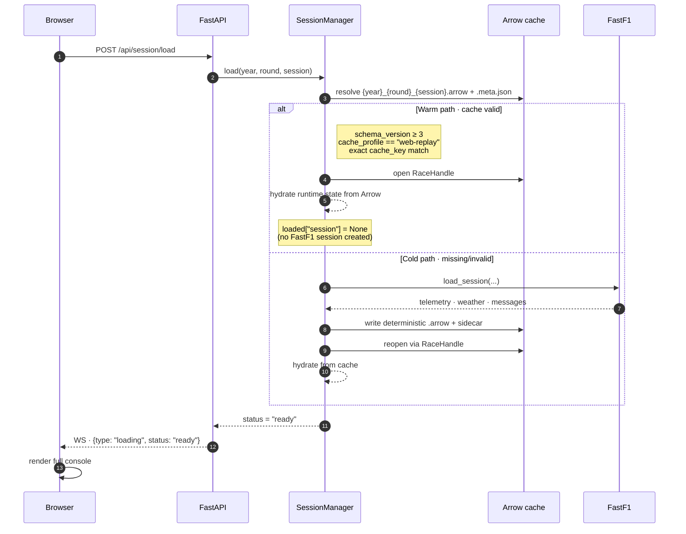
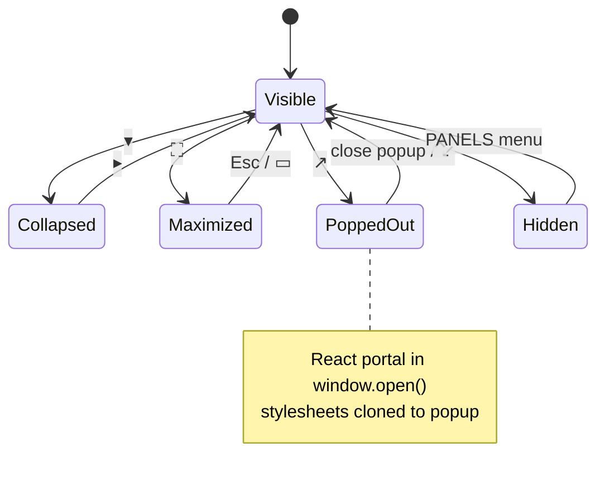
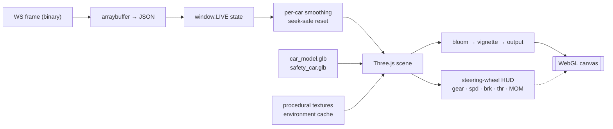
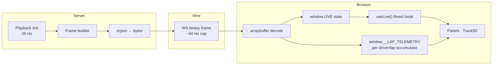
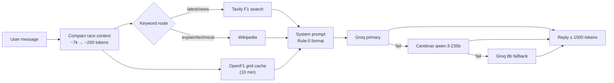

<div align="center">

# APEX · Pit Wall

**A browser-based Formula 1 race-engineer console**
React 18 · Three.js · FastAPI · WebSocket · FastF1

*A 9-panel dockable HUD for telemetry, strategy, classification, and 3D circuit replay — fed by a deterministic Arrow-cached pipeline.*

</div>

---

> This is the **primary README** for the project. The frontend (`project/`) and the FastAPI backend (`src/web/`) together form **APEX Pit Wall**, a full browser console built on top of the forked [4f4d/f1-race-replay](https://github.com/4f4d/f1-race-replay) FastF1 telemetry pipeline. The original PySide6/Arcade desktop runtime still works, but everything below describes the web stack — which is where active development lives.

---

## Table of Contents

1. [What it is](#what-it-is)
2. [Highlights](#highlights)
3. [Quick start](#quick-start)
4. [System architecture](#system-architecture)
5. [Cache-first session lifecycle](#cache-first-session-lifecycle)
6. [The Pit Wall UI](#the-pit-wall-ui)
7. [Panel system](#panel-system)
8. [Track rendering · Track3D + IsoTrack](#track-rendering--track3d--isotrack)
9. [Classification · leaderboard](#classification--leaderboard)
10. [Telemetry panels](#telemetry-panels)
11. [Strategy · gaps · race control](#strategy--gaps--race-control)
12. [Playback · timeline · camera](#playback--timeline--camera)
13. [Keyboard shortcuts](#keyboard-shortcuts)
14. [Theme & design system](#theme--design-system)
15. [Live data plumbing](#live-data-plumbing)
16. [Backend (`src/web/`)](#backend-srcweb)
17. [REST & WebSocket API](#rest--websocket-api)
18. [Engineer Chat + Bayesian tyre model](#engineer-chat--bayesian-tyre-model)
19. [Build & file map](#build--file-map)
20. [Extending the UI](#extending-the-ui)

---

## What it is

The upstream project shipped a **PySide6 + Arcade** desktop telemetry viewer that streamed over a TCP socket on port 9999. This fork keeps the desktop path intact and adds:

- A **React 18** browser frontend (`project/`) — the **APEX Pit Wall** — bundled by **esbuild** into a single IIFE.
- A **FastAPI + Uvicorn** server (`src/web/`) that exposes the FastF1 pipeline over **HTTP + WebSocket** on port 8000, in parallel with the legacy TCP-9999 stream.
- A **deterministic Arrow web cache** under `computed_data/web/v1/{year}_{round}_{session}.arrow` with sidecar metadata validation, enabling cache-first warm starts that skip FastF1 session creation entirely.
- An **Engineer Chat** AI window with live race context, fallback provider chain (Groq → Cerebras → Groq-8b), and a **Bayesian tyre-degradation model**.

Both runtimes coexist against the same FastF1 session.

---

## Highlights

| Area | What you get |
|---|---|
| **Console** | 9 dockable panels: hide / collapse / maximize / pop-out-to-new-window, persisted to `localStorage` |
| **Rendering** | Three.js WebGL scene with ACES tone mapping, bloom + vignette post, weather-aware materials, GLB car/safety-car models, **scalable quality presets** (`low`/`med`/`high`) |
| **Cameras** | Orbit · Follow/Chase · POV · top-down 2D · legacy SVG iso |
| **POV HUD** | Steering-wheel display: gear · speed · brake · throttle · MOM · tyre · lap · flag — rendered onto the cockpit wheel, with a live tuning panel (`W`) |
| **Telemetry** | Side-by-side compare traces (SPD/THR/BRK/GEAR/RPM) with live delta strip, sector-tinted progress, purple/green/yellow PB lap colouring |
| **Strategy** | Stint bars, pit-stop ticks, gap-to-leader spider, FIA Race Control feed with tagged badges (SC / FLAG / DRS / INFO) |
| **Backend** | FastAPI + WebSocket, **binary frame transport** (`orjson` bytes → `arraybuffer`), 25 Hz internal tick / ~60 Hz push cap |
| **Cache** | Cache-first warm starts hydrate state from Arrow; cold-cache builds rebuild deterministically with `schema_version >= 3` validation |
| **AI** | Engineer Chat window, 2026 season knowledge, F1-domain Tavily + OpenF1 search, ~200-token compacted race context |
| **Hardening** | Standings continuity guards, retired/incident handling, zero-allocation hot paths, SMAA edge AA, race-start seam fixes, wet-conditions visibility tuning |

---

## Quick start

```bash
# 1. Python deps
pip install -r requirements.txt

# 2. Frontend bundle (once, then on every src/ change)
cd project
npm install
npm run build
cd ..

# 3. Run the server
python -m src.web.pit_wall_server
```

Then open **<http://localhost:8000/app/Pit%20Wall.html>**.

With no race preselected, the app opens on the **RacePicker** screen (season selector + grid of round cards). Selecting a card POSTs `/api/session/load` and hands off to the loading overlay until `status: "ready"`.

To skip the picker and load a race directly at startup:

```bash
python -m src.web.pit_wall_server --year 2025 --round 12
```

### CLI flags

| Flag | Default | Description |
|---|---|---|
| `--year` | _(unset)_ | Championship year. Omit to show RacePicker. |
| `--round` | _(unset)_ | Round number (1-based). Omit to show RacePicker. |
| `--session-type` | `R` | `R` race · `Q` qualifying · `SQ` sprint quali |
| `--host` | `127.0.0.1` | Bind address |
| `--port` | `8000` | Bind port |
| `--cache-dir` | `cache/fastf1` | FastF1 HTTP cache directory |

### Frontend dev loop

```bash
cd project
npm run watch        # rebuild dist/bundle.js on change, with sourcemaps
```

The bundle loads React/ReactDOM as **CDN globals** (`unpkg.com/react@18.3.1`, `unpkg.com/react-dom@18.3.1`); only application code is bundled.

---

## System architecture

```mermaid
flowchart TB
    subgraph PY["Python process · pit_wall_server.py"]
        direction TB
        SM["SessionManager<br/>cache-first loader"]
        PB["Playback<br/>25 Hz tick · ~60 Hz push"]
        WS["WS Hub<br/>/ws/telemetry"]
        HTTP["FastAPI REST<br/>/api/*"]
        CHAT["Chat Bridge<br/>Groq → Cerebras → Groq-8b"]
        STATIC["Static mount<br/>/app → project/"]
        TCP["Legacy TCP 9999<br/>(insight windows, untouched)"]
        SM --> PB --> WS
        SM --> HTTP
        SM --> CHAT
        SM --> TCP
    end

    subgraph CACHE["Deterministic web cache"]
        ARROW["computed_data/web/v1/<br/>{year}_{round}_{session}.arrow"]
        META[".meta.json sidecar<br/>schema_version ≥ 3<br/>cache_profile: web-replay<br/>cache_key match"]
    end

    subgraph FF1["FastF1 (cold path only)"]
        F1API["Telemetry · Weather · Messages"]
    end

    subgraph BROWSER["Browser · Pit Wall.html"]
        direction TB
        APP["React 18 root · App.jsx"]
        TRACK["Track3D · Three.js scene"]
        PANELS["9 dockable panels"]
        LIVE["window.LIVE.useLive()"]
        APP --> TRACK
        APP --> PANELS
        APP --> LIVE
    end

    SM <--> CACHE
    SM -. cold cache only .-> FF1
    HTTP <-->|REST JSON| BROWSER
    WS <-->|binary frames<br/>(orjson → arraybuffer)| LIVE
    STATIC --> BROWSER

    classDef warm fill:#0d1f12,stroke:#1eff6a,color:#e8ffe8;
    classDef cold fill:#1f0d0d,stroke:#ff1e00,color:#ffe8e8;
    classDef neutral fill:#101418,stroke:#3a4654,color:#e7eef6;
    class CACHE warm
    class FF1 cold
    class PY,BROWSER neutral
```

**Two runtimes coexist:**

| Mode | Start command | Data path |
|---|---|---|
| **Headless web** *(default)* | `python -m src.web.pit_wall_server` | FastAPI + WS → React |
| **Legacy desktop** | `python main.py` | PySide6 → Arcade → TCP 9999 |

---

## Cache-first session lifecycle

`SessionManager.load(year, round, session_type)` has explicit warm and cold branches. The web cache is **deterministic** — given the same inputs, the same Arrow file is produced.



Loading-state messages surfaced to the UI:

`Checking web cache` → `Building web cache` → `Hydrating replay state` → `Ready`.

---

## The Pit Wall UI

Fixed three-rail grid sized to the viewport, with a persistent top bar and bottom timeline.

```
┌──────────────── TopBar (event · session · flag · weather · PANELS · live dot) ────────────────┐
│ Left Rail (320)     │   Center (flex)                          │  Right Rail (360)            │
│                     │                                          │                              │
│  CLASSIFICATION     │   CIRCUIT VIEW (Track3D / IsoTrack)      │   PRIMARY DRIVER             │
│                     │                                          │   COMPARE DRIVER             │
│                     │                                          │   GAP VISUALIZATION          │
│                     ├──────────────────────────────────────────┤                              │
│                     │ STRATEGY │ COMPARE │ SECTORS │ FEED      │                              │
└────────────────────────────── Timeline · transport · scrub · camera ──────────────────────────┘
```

**Global UI features:**

- **Flag-glow overlay** — viewport tints yellow (SC/VSC), red, or green via CSS keyframes (`apex-flag-glow-yellow`, `apex-flag-glow-red`).
- **Scanline** — optional CRT-style overlay (`.scanline::after`, 8 s loop).
- **Panel-mount animation** — fade/slide in (`apex-panel-in`, 120 ms).
- **Row pulse** — pinned leaderboard row flashes on sector boundary (`apex-row-pulse`, 450 ms).
- **Live dot** — pulsing green dot next to "TELEMETRY STREAM".
- **Edit mode** — parent-posted `__activate_edit_mode` message unlocks a Tweaks panel with camera presets and an accent-colour picker.
- Custom scrollbars · CSS-variable theming (`--bg`, `--red`, `--text` …) · radial-gradient background.

---

## Panel system

Every panel lives inside a [PanelFrame](project/src/PanelFrame.jsx) that provides four window-management affordances:

| Button | Glyph | Action |
|---|---|---|
| Collapse | `▾` / `▸` | Shrink to a 28 px title bar |
| Maximize | `⛶` / `▭` | Fullscreen overlay (92 % black + 4 px backdrop-blur); **Esc** to exit |
| Pop out | `↗` / `↙` | Open the panel in a separate `window.open()` popup; React portal at `#apex-popout-root` with cloned stylesheets |
| Close | `✕` | Hide; re-enable via the **PANELS** menu |

Buttons are hover-gated on hover-capable devices and always visible on touch. Layout persists to `localStorage` under `apex.panelLayout.v1`.

The nine registered panels ([PanelRegistry.jsx](project/src/PanelRegistry.jsx)):

| ID | Title |
|---|---|
| `leaderboard` | CLASSIFICATION |
| `track` | CIRCUIT VIEW |
| `strategy` | STRATEGY |
| `compare` | COMPARE TRACES |
| `sectors` | SECTOR TIMES |
| `feed` | RACE CONTROL |
| `driverCard` | PRIMARY DRIVER |
| `driverCard2` | COMPARE DRIVER |
| `gap` | GAP VISUALIZATION |



---

## Track rendering · Track3D + IsoTrack

[Track3D.jsx](project/src/Track3D.jsx) is the **primary** renderer for the circuit panel (`viewMode: webgl/follow/pov`). [IsoTrack.jsx](project/src/IsoTrack.jsx) remains as a legacy SVG renderer (`viewMode: iso/top`) — useful as a lightweight fallback or debug view.

### Track3D · default WebGL path

- Three.js renderer with **ACES** tone mapping; post-processing chain: **bloom** → **vignette** → output.
- 3D track layers — track surface · runoff · kerbs · grass/verges · barriers · gravel pockets — with weather-aware colour and material modulation.
- **GLB** driver and safety-car models with tuned cockpit framing, flat team-colour livery handling that preserves carbon, chrome, and wheel detail.
- Camera modes: **orbit**, **follow/chase**, **POV** — speed-reactive vignette and FOV behaviour in dynamic modes.
- In-scene overlays: floating labels · selection/compare halos · follow-cam HUD · steering-wheel POV HUD.
- **Steering-wheel live HUD** — gear · speed · throttle · brake · MOM state · tyre/lap info · last-lap tagging · flag state, rendered onto the pinned driver's cockpit wheel. SC/VSC mirrored into the wheel display; pit-limiter takeover only during genuine pit-lane segments.
- **Wheel-HUD tuning panel** — `W` toggles an on-screen control surface for quad placement, UV flipping, scale, and emissive intensity. Defaults in [project/src/track3d/constants.js](project/src/track3d/constants.js).
- Robust GLB fallback to primitive marker meshes if assets fail to load.
- Status-aware labels: `RET` and `ACC` badges; retired/incident cars hidden from track labels.
- Smoothing — data-path interpolation in `data.jsx`/`live_state.jsx`, per-car visual smoothing in Track3D, seek-safe buffer resets.
- Hardening: zero-allocation hot-path cleanups · SMAA edge AA · race-start seam/orientation fixes · wet-conditions visibility tuning.



### IsoTrack · legacy SVG path

**View modes:**

- **ISO (3D)** — CSS `perspective: 1800px`, `rotateX` (tilt 0–85°), `rotateZ` (spin ±180°). Default preset: tilt 62° · rotation −18° · zoom 100 %.
- **TOP (2D)** — flattens tilt; adds red/white **kerb pips** at high-curvature corners and a heading arrow on each car.

Zoom is **split** — two-thirds via CSS scale (framing), one-third via SVG viewBox (so vector geometry re-rasterizes crisply).

**Track geometry:**

- **Outline** — centripetal Catmull-Rom spline (α = 0.5), chosen to avoid self-intersection at hairpins.
- **Shoulder/runoff** — scaled outline at 1.012× for a cheap width effect.
- **Racing line** — dashed centerline.
- **Pit lane** — offset parallel from ~55 % onward · darker asphalt · dashed centerline.
- **Sectors** — three coloured markers (S1 red · S2 yellow · S3 cyan) perpendicular to the track.
- **Start/Finish** — checkered band (8×8) · red GRID line with glow · direction arrow · "S/F" label.
- **Corner labels** — curvature-detected (|Δangle| > 0.35) with 14-pt non-maximum suppression; up to 14 circled labels with connector lines and Gaussian drop-shadow filter.

**Driver cars:**

- Bucketed along 6-point track intervals with **orthogonal spread** so overlapping cars fan out laterally.
- Team-coloured fill (r = 11×scale) · centered position number · pinned driver = dashed red ring · secondary = dashed cyan ring.
- Hover halo (22 px) · trailing **speed halo** (opacity ∝ speed/350).
- `P` label in pit · greyed (opacity 0.3) if DNF · heading arrow in top-down · optional driver-code labels (`L` to toggle).

**Safety car:** golden (#FFB800) glowing circle · pulsing radius `22 + sin(pulse) × 6` · phase label `SAFETY CAR` / `SC DEPLOYING` / `SC IN`.

**Interaction:** click → pin primary · shift-click → toggle secondary.

---

## Classification · leaderboard

[Leaderboard.jsx](project/src/Leaderboard.jsx) — a dense engineering-style timing tower.

| Col | Content |
|---|---|
| Position | 2-digit left-padded |
| Team marker | 2 px vertical team-colour bar (accurate 2026 colours) |
| Driver | Code (bold) + team name (dim) below |
| Sector bar | 2 px fill, colour = active sector (S1 red · S2 yellow · S3 cyan), glow when pinned |
| Gap | `LEADER` or `+MM:SS.sss` |
| Interval | `+N.NNN` or `—` if leader |
| Last lap | `M:SS.sss` — **purple** = session fastest · **green** = PB · **yellow** = within 0.2 s of PB · white otherwise |
| Tyre pip | SVG circle in compound colour (S/M/H/I/W) with a tiny red dot when in pit |

**Selection highlights:**

- Pinned row — hot-red left border + horizontal gradient (12 % → 0 %).
- Secondary row — cool-cyan left border + gradient.
- Sector-transition pulse (`apex-row-pulse`) flashes the pinned row.

DNF drivers are dimmed and show `DNF` instead of tyre/gap.

---

## Telemetry panels

Three panels in [Telemetry.jsx](project/src/Telemetry.jsx).

### DriverCard · primary + compare

- Driver-number badge in team colour · code (bold) · full name (faint) · country code top-right.
- 2 px hot/cool accent strip (hot = pinned, cool = secondary).
- Two big readouts with glow: **SPEED** (kph) and **GEAR**.
- Throttle / Brake bars with 25/50/75 % ticks, glow under the filled portion, percentage readout.
- Micro-stats: **RPM** · **DRS** (OPEN green / CLSD gray) · **TYRE** (compound + laps).
- Empty compare card: dashed-border placeholder reading `SHIFT + CLICK DRIVER TO COMPARE`.

### CompareTraces

Side-by-side lap telemetry overlay.

- **5 channels** — SPD · THR · BRK · GEAR · RPM (button row top-left).
- Dual traces — pinned (hot red) vs secondary (cool cyan).
- **Interactive playhead** — vertical dashed line at the current track fraction; traces clipped to reveal up to the playhead, so even a fully-fetched lap animates "live" as time advances. Leading-edge dots mark the tip.
- Y-axis min/max labelled · grid lines at 0/25/50/75/100 %.
- Sector dividers from real `sector_boundaries_m` (1/3–2/3 fallback).
- **Delta strip** — `speed_a − speed_b` continuous line · centerline = zero · ±range in footer.
- `WAIT` badge while the server trace endpoint resolves.

### SectorTimes

Compact `Driver · S1 · S2 · S3 · Total` table. Rows: primary (hot) · secondary (cool) · session best (purple). Cell colouring: **purple** (session best & PB) · **green** (PB) · white otherwise.

---

## Strategy · gaps · race control

From [Panels.jsx](project/src/Panels.jsx).

### StrategyStrip

Tyre-strategy visualisation for the top 10 drivers. One horizontal row per driver: position · team colour · code · stint bar.

- Stints coloured by compound (S red · M yellow · H white · I green · W blue).
- Stint opacity by time: completed laps `0.55` · current `0.85` · future `0.25`.
- **Pit stops** — yellow vertical ticks (± 3 px).
- **Current-lap marker** — white vertical line.

### GapViz

Gap-to-leader "spider". Per row: driver code · proportional bar · numeric gap. Bar in team colour; pinned driver highlighted hot red.

### RaceFeed

FIA race-control messages with **tagged badges**:

| Tag | Colour | Meaning |
|---|---|---|
| SC | yellow | Safety car deployment |
| FLAG | red-orange | Yellow/red flag |
| DRS | red-orange | DRS enabled/disabled |
| INFO | subtle gray | Everything else |

Time-stamped `MM:SS.sss`, newest at top, binary-searched against playback time so seeking backward hides future messages.

---

## Playback · timeline · camera

[Controls.jsx](project/src/Controls.jsx) houses the TopBar, the bottom Timeline, and the floating CameraControls.

### TopBar

- **Left** — `APEX · PITWALL` logo · event (Year · R# · Name) · session type · circuit name · length.
- **Center** — flag badge (GREEN / YELLOW / RED FLAG / SAFETY CAR / VIRTUAL SC) · `LAP XX/YY` · clock (HH:MM:SS) · AIR / TRACK / HUMIDITY temps.
- **Right** — PANELS dropdown · pulsing green live dot · "TELEMETRY STREAM" label.

### Timeline

- **Transport** — `◀◀` (back 2 %, shift 5 %) · Play/Pause · `▶▶` (forward 2 %, shift 5 %).
- **Speed buttons** — `0.5×` · `1×` · `2×` · `4×` (selected = hot-red bg).
- **Scrub track** (42 px tall) — lap tick markers · sector-zone shading · **safety-car zones** with yellow borders and "SC" labels · playhead = 2 px glowing red line + triangle pointer · progress fill glows with accent.
- **LAP XX/YY** counter bottom-right.

### CameraControls

Top-right floating overlay, collapsible with `C`.

- **View mode** — segmented toggle `GL` / `SVG` / `CHASE` / `POV` / `TOP`.
- **QUALITY** — `LOW` / `MED` / `HIGH` for WebGL modes (`GL`, `CHASE`, `POV`).
- **TILT / ROT / ZOOM** sliders for legacy SVG modes.
- **LABELS** toggle (`L`) · **HIDE [C]** collapse · **RESET** to broadcast preset.

In `POV`, the floating HUD is replaced by the steering-wheel display. `H` toggles the follow-cam overlay; `W` opens the wheel-HUD tuning panel.

Camera state is client-local; presets in edit mode include **BROADCAST**, **TOP DOWN**, **LOW ANGLE**, **PADDOCK**.

---

## Keyboard shortcuts

From [hotkeyHandler.js](project/src/hotkeyHandler.js) — ref-based to avoid stale closures; suppressed when an `<input>` or `<textarea>` has focus.

| Key | Action |
|---|---|
| `Space` | Play / Pause |
| `←` / `→` | Seek ±1 % (hold `Shift` for ±5 %) |
| `↑` / `↓` | Speed up / down through `[0.5, 1, 2, 4]` |
| `1` / `2` / `3` / `4` | Set speed directly |
| `R` | Restart (seek to 0) |
| `L` | Toggle driver labels |
| `M` | Toggle view mode (`TOP` ↔ `WEBGL`) |
| `D` | Force WebGL view |
| `F` | Toggle chase camera (`FOLLOW` ↔ `WEBGL`) |
| `H` | Toggle follow-cam HUD visibility |
| `W` | Toggle wheel-HUD tuning panel (debug) |
| `C` | Collapse / expand camera controls |
| `Esc` | Exit panel maximize |

> DRS and progress-bar toggles from the original app were intentionally **removed** for 2026 — DRS is abolished under the new regs and replaced by manual override (**MOM**).

---

## Theme & design system

Centralised in [theme.js](project/src/theme.js). All colours, spacing, typography, and motion durations are referenced from this module — any new panel inherits the look automatically.

**Accent palette:**

| Token | Hex | Use |
|---|---|---|
| `hot` | `#FF1E00` | Primary accent / pinned driver |
| `cool` | `#00D9FF` | Secondary / compare driver |
| `good` | `#1EFF6A` | Personal-best / positive |
| `warn` | `#FFD93A` | S2 / caution |
| `caution` | `#FFB800` | Safety car |
| `purple` | `#C15AFF` | Session best |

**Surfaces** layer `surface` → `surface2` → `surface3` → `surfaceFlat` (dark translucent gradients). Borders are 1 px rgba-white at 4–6 %, with `borderHot` and `borderCool` variants for highlighted states.

**Typography** — JetBrains Mono throughout. Size scale: `xs 9` / `sm 10` / `md 12` / `lg 14` / `xl 24`. Letter-spacing: `tight 0.02em` → `wide 0.2em`. Body copy (Geist) on `<body>` for non-monospace.

**Motion scale** — `micro 60 ms` · `short 120 ms` · `medium 200 ms`. Panel mounts, sector-bar fills, flag glows, and pulses all reference these.

---

## Live data plumbing

Three globals wire the app to the backend:

| Global | Module | Contents |
|---|---|---|
| `window.APEX` | [data.jsx](project/src/data.jsx) | `TEAMS`, `DRIVERS`, `CIRCUIT`, `SECTORS`, `COMPOUNDS`, `computeStandings()`, `telemetryFor()`, `lapTrace()`, `fetchLapTrace()`, `getSessionBest()`, `getStints()`, `getPitStops()` |
| `window.LIVE.useLive()` | [live_state.jsx](project/src/live_state.jsx) | React hook → `{ frame, snapshot, playback, rc, loading }` |
| `window.APEX_CLIENT` | [apex_client.jsx](project/src/apex_client.jsx) | `get()`, `post()`, `openSocket()` (WS with exponential-backoff reconnect, capped at 10 s) |



**Loading gate** ([loading_gate.jsx](project/src/loading_gate.jsx)) shows a dark 72 % overlay with a 320 px red progress bar while FastF1 hydrates. Waits on **both** an `APEX_DATA_READY` promise *and* the WS `loading: { status: "ready" }` message; falls back to polling `/api/session/status` every 1 s if the socket is slow.

**Telemetry accumulator** — `window.__LAP_TELEMETRY` buckets live frames by driver/lap so CompareTraces can render partial current-lap data before the server endpoint returns.

**Trace caching** — server-fetched traces (full lap, accurate) preferred, with in-flight dedup; live accumulator is the fallback. All traces resampled to 120 uniform points for rendering.

---

## Backend (`src/web/`)

| File | Role |
|---|---|
| [pit_wall_server.py](src/web/pit_wall_server.py) | FastAPI + Uvicorn entry · argparse · static mount `/app` → `project/` |
| [session_manager.py](src/web/session_manager.py) | Cache-first web loader · warm hydrates from Arrow · cold rebuilds via FastF1 |
| [cache_utils.py](src/web/cache_utils.py) | Deterministic cache-key helpers · sidecar metadata IO |
| [playback.py](src/web/playback.py) | Wall-clock playhead (25 Hz internal · ~60 Hz WS push cap) · frame builder |
| [ws_hub.py](src/web/ws_hub.py) | WebSocket connection manager and broadcaster |
| [ws_routes.py](src/web/ws_routes.py) | `/ws/telemetry` endpoint |
| [http_routes.py](src/web/http_routes.py) | REST endpoints |
| [chat_bridge.py](src/web/chat_bridge.py) | Headless adapter for Engineer Chat (Groq → Cerebras → Groq-8b) |
| [serialization.py](src/web/serialization.py) | NumPy / Pandas → JSON-safe via ORJSONResponse |
| [flags.py](src/web/flags.py) | `track_statuses` → `flag_state` bisect helper |
| [schemas.py](src/web/schemas.py) | Pydantic v2 models |

This is a **superset** of the existing data path — the TCP-9999 stream used by the PySide6 insight windows is untouched, so both the desktop Arcade viewer and the browser Pit Wall can run against the same FastF1 session.

---

## REST & WebSocket API

### REST

| Method | Path | Returns |
|---|---|---|
| `GET` | `/api/seasons` | `{ seasons: [2018..2026] }` |
| `GET` | `/api/seasons/{year}/rounds` | Race calendar |
| `POST` | `/api/session/load` | `202 { ok, status: "loading" }` (non-blocking) |
| `GET` | `/api/session/status` | `{ status, progress, message, year?, round? }` |
| `GET` | `/api/session/summary` | Event info · drivers · total laps |
| `GET` | `/api/session/geometry` | Centerline · DRS zones · sector boundaries · bbox |
| `GET` | `/api/session/race_control?since=<s>` | Race-control messages |
| `GET` | `/api/session/results` | Best-effort classification |
| `GET` | `/api/session/lap_telemetry/{code}/{lap}` | Per-driver lap telemetry |
| `POST` | `/api/playback/play` | `{ ok: true }` |
| `POST` | `/api/playback/pause` | `{ ok: true }` |
| `POST` | `/api/playback/seek` | Body `{ t: 0.42 }` (fraction) |
| `POST` | `/api/playback/speed` | Body `{ speed: 0.5\|1\|2\|4 }` |
| `POST` | `/api/chat` | Engineer Chat · rate-limited 1 req / 2 s / IP |

### WebSocket · `/ws/telemetry`

| `type` | When | Key fields |
|---|---|---|
| `loading` | Before session is ready | `status` · `progress` · `message` |
| `snapshot` | On ready / on reconnect | Full state: geometry · driver_meta · standings · race_control_history · session_best · stints · pit_stops |
| `frame` | 25–60 Hz during playback | `frame_index` · `t_seconds` · `lap` · `flag_state` · `standings` · `playback_speed` · `is_paused` · `weather` · `safety_car` · `new_rc_events` |

Frames are transmitted as **binary** — the server emits `orjson` bytes directly; the client decodes from `arraybuffer` to skip a UTF-8 round-trip.

---

## Engineer Chat + Bayesian tyre model

Introduced at the initial fork commit and hardened through April 2026. Preserved and integrated with the new frontend through `chat_bridge.py` and `POST /api/chat`.

**Engineer Chat** ([src/insights/engineer_chat_window.py](src/insights/engineer_chat_window.py)):

- Live race context injected into every message — tyre age · stint laps · pit stops · flag state.
- **Provider fallback chain** — Groq (primary) → Cerebras (`qwen-3-235b`) → Groq-8b.
- Hard 1,500-token cap per request.
- Race context compacted from ~7,000 → ~200 tokens.
- Search sources — Tavily (F1-domain-filtered), Wikipedia, OpenF1 API (10-minute grid cache).
- Keyword-driven routing between "latest/news" vs "explain/technical" queries.
- Mandatory Rule-0 opening format in system prompt.
- Lazy Cerebras import to avoid hard dependency at startup.



**2026 season data** ([src/data/f1_season_data.py](src/data/)) — 22 drivers with ages and car numbers · 11 teams with principals and power units · 24-race calendar · new 2026 tech regs (50/50 ICE/EV split, active aero, MOM replacing DRS) · 2027 provisional driver list.

**Bayesian tyre-degradation model** ([src/bayesian_tyre_model.py](src/bayesian_tyre_model.py)) — state-space degradation across **SLICK / INTER / WET** compounds with track-abrasion, fuel-effect, warmup, and condition-mismatch penalties. Drives the leaderboard tyre displays and telemetry panels through [src/tyre_degradation_integration.py](src/tyre_degradation_integration.py).

---

## Build & file map

```
project/                                # React frontend
├── Pit Wall.html                       # HTML entry; loads React from CDN + dist/bundle.js
├── build.mjs                           # esbuild: src/index.jsx → dist/bundle.js (IIFE)
├── package.json                        # build / watch scripts
├── dist/bundle.js                      # compiled output
└── src/
    ├── index.jsx                       # Module load order; window.XXX exports
    ├── theme.js                        # Design tokens
    ├── apex_client.jsx                 # HTTP + WS client
    ├── live_state.jsx                  # WS subscriber (React context)
    ├── loading_gate.jsx                # Cold-load progress overlay
    ├── data.jsx                        # window.APEX live-data shim
    ├── App.jsx                         # Root component; rail grid; state
    ├── RacePicker.jsx                  # Season + round selection screen
    ├── Track3D.jsx                     # Three.js scene orchestration · camera logic · animation loop
    ├── IsoTrack.jsx                    # Legacy 3D/2D SVG renderer (fallback modes)
    ├── Leaderboard.jsx                 # Classification panel
    ├── Telemetry.jsx                   # DriverCard · CompareTraces · SectorTimes
    ├── Panels.jsx                      # StrategyStrip · GapViz · RaceFeed
    ├── PanelRegistry.jsx               # Panel ID ↔ title table
    ├── PanelFrame.jsx                  # Collapse / maximize / popout chrome
    ├── Controls.jsx                    # TopBar · Timeline · CameraControls
    ├── hotkeyHandler.js                # Keyboard shortcuts
    ├── track3d/
    │   ├── atmosphere.js               # Sky · rain · trackside set-dressing · time-of-day
    │   ├── cars.js                     # GLB loading · marker construction · material/livery
    │   ├── constants.js                # Wheel-HUD tuning defaults
    │   ├── geometry.js                 # Track ribbons · gates · terrain · helper geometry
    │   ├── hud.js                      # Follow HUD · steering-wheel HUD · tuning panel
    │   ├── index.js                    # Track3D helper barrel exports
    │   ├── labels.js                   # DOM label layer helpers
    │   ├── textures.js                 # Procedural textures · environment cache
    │   └── wheelHudAttachment.js       # Steering-wheel HUD attach / detach / reapply
    └── App.test.jsx                    # Tests

src/web/                                # FastAPI backend
├── pit_wall_server.py                  # Entry + static mount
├── session_manager.py                  # Cache-first web loader + deterministic cache builder
├── cache_utils.py                      # Cache-key + sidecar helpers
├── playback.py                         # Playhead + frame builder
├── ws_hub.py                           # WS connection manager
├── ws_routes.py                        # /ws/telemetry
├── http_routes.py                      # REST endpoints
├── chat_bridge.py                      # Engineer Chat adapter
├── serialization.py                    # NumPy/Pandas → JSON
├── flags.py                            # Track status → flag state
└── schemas.py                          # Pydantic v2 models

car_model.glb                           # 3D F1 car asset used by Track3D
safety_car.glb                          # 3D safety car asset used by Track3D
```

**Build specifics** ([project/build.mjs](project/build.mjs)):

- Entry `src/index.jsx` · output `dist/bundle.js` · format **IIFE** (no module exports).
- JSX transformed via `React.createElement` / `React.Fragment`.
- Targets — Chrome 90+ · Firefox 90+ · Safari 15+.
- React and ReactDOM **not bundled** — loaded as CDN globals from `unpkg.com/react@18.3.1` and `unpkg.com/react-dom@18.3.1`.
- All modules write exports onto `window.XXX` so the IIFE just needs side-effects — no export reconciliation.
- Minify on for production · sourcemaps on for `--watch`.

---

## Extending the UI

Drop a new `.jsx` file into `project/src/`, grab live data from `window.LIVE.useLive()`, and register a panel entry in `PanelRegistry.jsx`:

```jsx
function MyPanel() {
  const { frame, playback } = window.LIVE.useLive();
  if (!frame) return <div>Loading…</div>;
  return (
    <div>
      <div>Lap {frame.lap}/{frame.total_laps} · {playback.speed}×</div>
      {frame.standings.map(s => (
        <div key={s.code}>{s.pos}. {s.code} — {s.speed_kph} km/h</div>
      ))}
    </div>
  );
}
window.MyPanel = MyPanel;
```

Add it to the registry, wrap it in a `<PanelFrame>` inside `App.jsx`, and it inherits hide / collapse / maximize / popout / `localStorage` persistence automatically.

---

<div align="center">

**APEX · Pit Wall** — built on top of [4f4d/f1-race-replay](https://github.com/4f4d/f1-race-replay).
React 18 · Three.js · FastAPI · FastF1.

</div>
